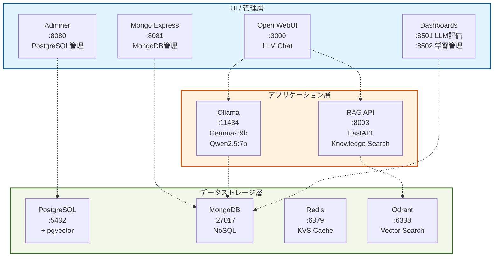

# システムアーキテクチャ

## 全体構成図



## レイヤー構成

### 1️⃣ UI / 管理層

| サービス | ポート | 用途 | URL |
|---------|--------|------|-----|
| **Open WebUI** | 3000 | LLMチャットインターフェース | http://localhost:3000 |
| **Adminer** | 8080 | PostgreSQL管理UI | http://localhost:8080 |
| **Mongo Express** | 8081 | MongoDB管理UI | http://localhost:8081 |
| **LLM評価ダッシュボード** | 8501 | モデル性能比較 | http://localhost:8501 |
| **学習管理ダッシュボード** | 8502 | 学習記録・目標管理 | http://localhost:8502 |

### 2️⃣ アプリケーション層

| サービス | ポート | 用途 | モデル/技術 |
|---------|--------|------|------------|
| **Ollama** | 11434 | ローカルLLMエンジン | Gemma2:9b (メインタスク)<br/>Qwen2.5:7b (静香ペルソナ) |
| **RAG API** | 8003 | 知識検索API | FastAPI<br/>SentenceTransformer<br/>(all-MiniLM-L6-v2) |

### 3️⃣ データストレージ層

| サービス | ポート | 種別 | 用途 |
|---------|--------|------|------|
| **PostgreSQL** | 5432 | RDBMS | リレーショナルデータ<br/>+ pgvector拡張 |
| **MongoDB** | 27017 | NoSQL | 学習セッション記録<br/>メッセージ履歴 |
| **Redis** | 6379 | KVS | キャッシュ<br/>高速データアクセス |
| **Qdrant** | 6333 | Vector DB | RAG知識ベース<br/>ベクトル類似検索 |

## データフロー

### 📊 LLMチャット (Open WebUI)
```
ユーザー → Open WebUI
           ↓
        RAG API → Qdrant (知識検索)
           ↓
        Ollama (LLM) → MongoDB (履歴保存)
           ↓
        Open WebUI → ユーザー
```

### 📚 知識追加フロー
```
ドキュメント (.pdf/.md/.txt/.html)
    ↓
rag_system.py (チャンク分割)
    ↓
SentenceTransformer (ベクトル化)
    ↓
Qdrant (保存)
```

### 📈 学習記録フロー
```
Open WebUI (チャット)
    ↓
learning_tracker.py
    ↓
MongoDB (sessions/messages)
    ↓
learning_dashboard.py (可視化)
```

## コンポーネント詳細

### Ollama LLMモデル

| モデル | サイズ | 用途 | 性能 |
|--------|--------|------|------|
| **Gemma2:9b** | 5.4GB | メインタスク<br/>汎用質問応答 | 日本語: 66.7%<br/>ペルソナ: 91.7%<br/>総合: 79.2% |
| **Qwen2.5:7b** | 4.7GB | 静香ペルソナ専用<br/>キャラクター対話 | 日本語: 44.4%<br/>ペルソナ: **100%**<br/>総合: 72.2% |

### RAG システム

```
コンポーネント:
- rag_system.py     : 知識管理コア
- rag_api.py        : FastAPIサーバー
- openwebui_rag_function.py : Open WebUI統合
- add_knowledge.sh  : 知識追加スクリプト

サポート形式:
- PDF (.pdf)
- Markdown (.md)
- Text (.txt)
- HTML (.html)

処理フロー:
1. ドキュメント読み込み
2. チャンク分割 (500文字、100文字オーバーラップ)
3. ベクトル化 (all-MiniLM-L6-v2)
4. Qdrant保存
5. 類似度検索 (コサイン類似度)
```

### 学習管理システム

```
MongoDB Collections:
- sessions  : 学習セッション
- messages  : メッセージ履歴
- goals     : 学習目標

追跡データ:
- 学習時間 (日次/週次)
- セッション数
- トピック分布
- 目標進捗率
```

## インフラ構成

### Docker Compose構成

```yaml
サービス数: 8
- postgres (PostgreSQL + pgvector)
- mongodb (MongoDB)
- redis (Redis)
- qdrant (Qdrant)
- ollama (Ollama LLM)
- adminer (PostgreSQL UI)
- mongo-express (MongoDB UI)
- open-webui (LLM Chat UI)

ネットワーク: local_network (bridge)
ボリューム: 8個 (永続化)
```

### リソース要件

| 項目 | 推奨値 |
|------|--------|
| CPU | 4コア以上 |
| メモリ | 12GB以上 |
| ディスク | 60GB以上 |
| Docker | Colima推奨 |

```bash
# Colima推奨設定
colima start --disk 60 --cpu 4 --memory 12
```

## 起動・停止

### 全サービス起動
```bash
cd "/path/to/LocalDBKit"
docker-compose up -d
```

### ヘルスチェック
```bash
./health-check.sh
```

### 停止
```bash
docker-compose down
```

### 完全削除 (データも削除)
```bash
docker-compose down -v
```

## アクセスURL一覧

| サービス | URL | 備考 |
|---------|-----|------|
| Open WebUI | http://localhost:3000 | 初回: アカウント作成 |
| RAG API | http://localhost:8003 | API Docs: /docs |
| Adminer | http://localhost:8080 | postgres/password |
| Mongo Express | http://localhost:8081 | admin/password |
| Qdrant Dashboard | http://localhost:6333/dashboard | - |
| LLM評価 | http://localhost:8501 | Streamlit |
| 学習管理 | http://localhost:8502 | Streamlit |

## セキュリティ

### ⚠️ 注意事項
- **完全ローカル環境** - 外部公開しない
- **デフォルトパスワード使用** - 本番環境では変更必須
- **ポート開放範囲** - localhost (127.0.0.1) のみ
- **APIキー管理** - .envファイルはGit除外済み

### 認証情報 (.env)
```bash
# PostgreSQL
POSTGRES_USER=postgres
POSTGRES_PASSWORD=password

# MongoDB
MONGO_INITDB_ROOT_USERNAME=admin
MONGO_INITDB_ROOT_PASSWORD=password

# Redis (認証なし)
# Qdrant (認証なし)
```

## 開発・運用

### ログ確認
```bash
# 全サービス
docker-compose logs -f

# 特定サービス
docker-compose logs -f ollama
docker-compose logs -f rag-api
```

### データバックアップ
```bash
# PostgreSQL
docker exec local_postgres pg_dump -U postgres dbname > backup.sql

# MongoDB
docker exec local_mongodb mongodump --out /backup

# Qdrant (スナップショット)
curl -X POST http://localhost:6333/collections/knowledge/snapshots
```

### パフォーマンス監視
```bash
# リソース使用状況
docker stats

# 特定コンテナ
docker stats local_ollama
```

## 拡張性

### 新しいLLMモデル追加
```bash
# Ollamaコンテナ内
docker exec -it local_ollama ollama pull <model-name>

# 評価
python3 test_ollama_evaluation.py --model <model-name>
```

### 新しいデータベース追加
1. `docker-compose.yml` にサービス定義追加
2. `.env` に環境変数追加
3. `docker-compose up -d` で起動

### RAG知識拡張
```bash
# 個別ファイル
./add_knowledge.sh /path/to/document.pdf

# フォルダ一括
./add_knowledge.sh /path/to/documents/

# 確認
python3 rag_system.py list
```

---

**作成日**: 2026年3月15日
**作成者**: Claude Sonnet 4.5 (Anthropic)
**バージョン**: 1.0.0
**プロジェクト**: データベース構築 - 完全ローカル開発環境
